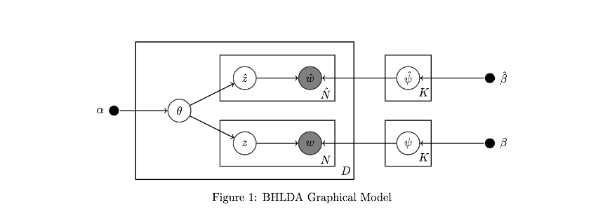
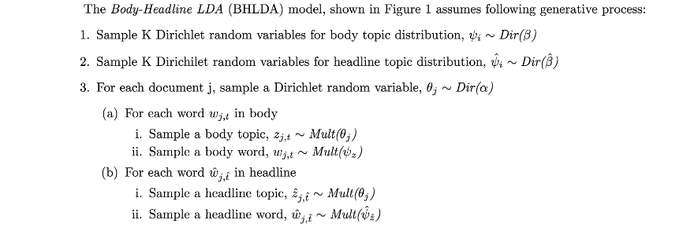

# Body-Headline Latent Dirichilet Allocation
This is the course project for [STATS2014: Foundations of Graphical Models](http://www.cs.columbia.edu/~blei/fogm/2014F/index.html) undertaken by [Francois](https://www.linkedin.com/in/francoisfagan/) and myself. The C++ code in [GibbsSampler](/GibbsSampler/) is written by Francois. 
 
<b>Note:</b> The repository has not been well maintained. Please open an issue if there is something that needs to be explained.

## Motivation
The project aims at finding relevance of article headline to the article body using the extended model of Latent Dirichilet Allocation.  
The internet is full of [clickbaits](https://en.wikipedia.org/wiki/Clickbait). This research aims at finding those articles which have catchy headlines but the content has a little relevance to it. The idea is to infer topic distributions for body and headline separately and find the distance using [KL divergence](https://en.wikipedia.org/wiki/Kullback%E2%80%93Leibler_divergence).
## Graphical Model

## Generative Model

## More Description
More about the model, results, and application is discussed in [the final paper](./docs/main.pdf).
 
Gibbs Sampling was used for this. The code (C++) is in [GibbsSampler](./GibbsSampler).
## Dataset
[The New York Times Annotated Corpus](https://catalog.ldc.upenn.edu/ldc2008t19) was used for the project.
## Result Snapsot
The snapshot below shows the word distribution for a body topic and headline topic. These word distributions were manually matched and annotated with a reasonable category.
 

