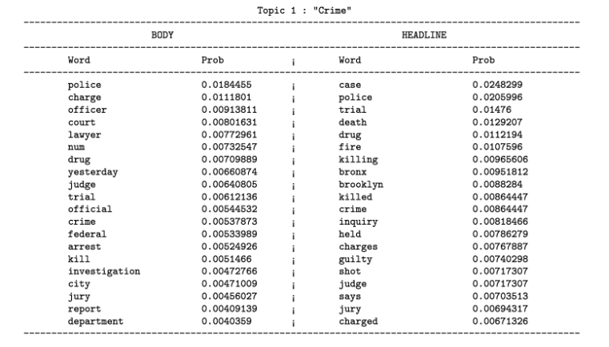

# Body-Headline Latent Dirichilet Allocation

I worked on this project as part of the course [STATS2014: Foundations of Graphical Models](http://www.cs.columbia.edu/~blei/fogm/2014F/index.html)
 
<b>Note:</b> The repository has not been well maintained. Please open an issue if there is something that needs to be explained.
 

## Motivation
The project aims at finding relevance of article headline to the article body using the extended model of Latent Dirichilet Allocation.  
The internet is full of [clickbaits](https://en.wikipedia.org/wiki/Clickbait). The project was geared towards finding those articles which have catchy headlines but the content itself has a little relevance to the headline. The idea was to infer topic distributions for body and headline separately and compare the distance using [KL divergence](https://en.wikipedia.org/wiki/Kullback%E2%80%93Leibler_divergence).

## Graphical Model
 

## Generative Model

## More Description
More about the model, results, and application is discussed in [the final paper](./docs/main.pdf).

## Dataset
[The New York Times Annotated Corpus](https://catalog.ldc.upenn.edu/ldc2008t19) was used for the project.

## Result Snapsot
The snapshot below shows the word distribution for a body topic and headline topic. These word distributions were manually matched and annotated with a reasonable category.
 

